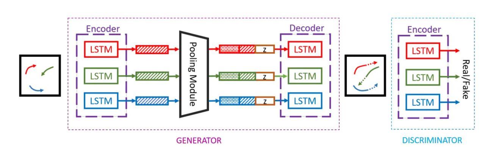
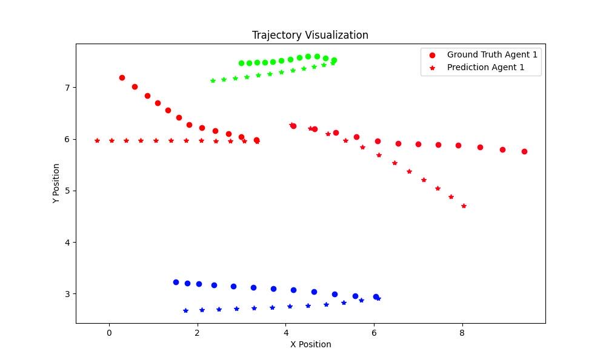

# 1 模型介绍

## 1.1 模型概述
Social-GAN是一种用于多人轨迹预测的生成对抗网络模型，由2018年的行人轨迹预测领域经典论文《Social gan: Socially acceptable trajectories with generative adversarial networks》提出，迄今为止已被引用2000余次。该模型的基本思想是通过生成对抗网络（GAN）来使输出的预测轨迹尽可能贴近真实未来轨迹，其中生成器负责根据历史轨迹生成未来预测轨迹，判别器则评估生成的轨迹是否是真实的。通过对抗性训练，生成器逐渐学会生成更为逼真的轨迹，最终使得判别器无法区分真伪，即达到了期望的目的。为了将场景中多个主体的交互影响纳入考虑，Social-GAN引入了一种新颖的池化机制，克服了过去方法中只能对局部范围内交互进行建模的不足，使得生成的轨迹更加符合多主体的社会行为模式。

## 1.2 模型架构
Social-GAN模型的整体架构如下，由生成器与判别器两部分组成：
	

 ### 1.2.1 生成器

模型的生成器部分是一个基于RNN的Encoder-Decoder架构。在输入编码器之前，首先使用一个单层的MLP将每个人的历史位置嵌入为一个固定长度的向量，随后输入LSTM进行编码得到隐藏状态（hidden state）。这个隐藏状态捕捉了每个人的历史动态，但无法捕捉人与人之间的交互，为此，模型采用池化模块（Pooling Module）来建模全局场景中行人之间的交互。

具体而言，模型会针对每一个个体，利用所有人的隐藏状态生成一个全局池化向量，这一操作通过池化模块里的多层感知机（MLP）和max-pooling操作实现。随后，解码器接收全局池化向量以及个人历史轨迹的隐藏状态作为输入，输入下一时刻的隐藏状态，并通过一个MLP输出预测的未来位置坐标。

### 1.2.2 判别器

判别器接收完整的轨迹序列作为输入，即“历史轨迹+真实未来轨迹”或“历史轨迹+预测未来轨迹”，并使用LSTM对输入轨迹序列进行编码。最后，通过一个MLP获取该序列的分类得分，以此为依据判别其是“真实的”还是“生成的”。

 ## 1.3具体实现

- 为了促进多样性样本生成，模型生成器从标准正态分布中随机采样多个噪声变量，并根据这些噪声变量生成不同的未来轨迹。此外，Social-GAN引入了一种多样性损失，以确保生成器不仅能够生成不同的样本，还能使生成样本尽可能接近真实情况。

# 2 代码解读

- 此模型需要在Linux环境下运行，需要具备一定Linux基础知识，预装Anaconda/Miniconda
- 需要英伟达的独立显卡，且部署好cuda以便使用GPU进行训练(测试采用cuda11.1，cuda版本不同可能需要更改pytorch的版本；且由于用户初始环境存在差异，本地python虚拟环境配置仅供参考，遇到报错建议上网搜索）
    

## 2.1 文件下载

### 2.1.1 代码文件下载

```bash
##下载代码文件sgan-master.tar文件至本地（此代码文件里面部分代码为适应较新版本的库文件作了相应修改）
#解压
tar -xvf sgan-master.tar
cd sgan-master
```

### 2.1.2 数据集下载和准备

创建本地文件夹存放原始数据，有需要可以在.sh文件中修改路径等

```bash
bash scripts/download_data.sh  #此步骤可能需要几分钟以上，请耐心等待，并注意程序是否异常，若无法在线下载可以，尝试使用梯子；或者可以直接下载datasets.zip文件至解压后的sgan-master文件下
```

download_data.sh内容如下：

```bash
## prepare data 
wget -O datasets.zip 'https://www.dropbox.com/s/8n02xqv3l9q18r1/datasets.zip?dl=0'
unzip -q datasets.zip
rm -rf datasets.zip
```

## 2.2 本地python虚拟环境配置

```bash
conda create -n sgan python=3.8.0
conda activate sgan
pip install torch==1.8.1+cu111 torchvision==0.9.1+cu111 torchaudio==0.8.1 -f https://download.pytorch.org/whl/torch_stable.html
pip install -r requirements.txt
```

## 2.3 数据导入

调用get_dset_path.py和data_loader.py中的功能函数，实现的数据导入。

```SQL
from sgan.data.loader import data_loader
from sgan.utils import relative_to_abs, get_dset_path

train_path = get_dset_path(args.dataset_name, 'train')
train_dset, train_loader = data_loader(args, train_path)
```

## 2.4 模型训练

```bash
##可根据需要自定义改动下述配置参数

python train.py \
  --dataset_name 'zara1' \
  --delim tab \
  --d_type 'local' \
  --pred_len 8 \
  --encoder_h_dim_g 32 \
  --encoder_h_dim_d 64\
  --decoder_h_dim 32 \
  --embedding_dim 16 \
  --bottleneck_dim 32 \
  --mlp_dim 64 \
  --num_layers 1 \
  --noise_dim 8 \
  --noise_type gaussian \
  --noise_mix_type global \
  --pool_every_timestep 0 \
  --l2_loss_weight 1 \
  --batch_norm 0 \
  --dropout 0 \
  --batch_size 128 \
  --g_learning_rate 1e-3 \
  --g_steps 1 \
  --d_learning_rate 1e-3 \
  --d_steps 2 \
  --checkpoint_every 10 \
  --print_every 50 \
  --num_iterations 20000 \
  --num_epochs 500 \
  --pooling_type 'pool_net' \
  --clipping_threshold_g 1.5 \
  --best_k 10 \
  --gpu_num 1 \
  --checkpoint_name gan_test \
  --restore_from_checkpoint 0


##训练命令解释：
  --batch_size 32 \                   # 每个小批量训练中使用的序列数，默认为64。
  --num_iterations 20000 \            # 训练的迭代次数，默认为10,000。
  --num_epochs 500 \                  # 训练轮数，默认为200。
  
  --dataset_name 'zara1' \            # 训练使用的数据集，需在支持的数据集中选择，默认为zara1。
  --delim tab \                        # 数据集中使用的文件分隔符，默认为空格。
  --obs_len 8 \                        # 输入轨迹的时间步数，默认为8。
  --pred_len 8 \                       # 输出轨迹的时间步数，默认为8。
  --loader_num_workers 4 \             # 用于数据加载的后台线程数，默认为4。
  --skip 1 \                           # 制作数据集时跳过的帧数，默认为1。
  
  --embedding_dim 64 \                 # 输入(x, y)坐标的嵌入层维度，默认为64。
  --num_layers 1 \                     # LSTM的层数，仅支持num_layers=1。
  --dropout 0 \                        # Dropout比例，默认为0（不使用）。
  --batch_norm 0 \                     # 是否使用批归一化，默认为False。
  --mlp_dim 1024 \                     # 多层感知机的维度，默认为1024。
  
  --encoder_h_dim_g 64 \              # 编码器隐藏层的维度，默认为64。
  --decoder_h_dim_g 64 \              # 解码器隐藏层的维度，默认为64。
  --noise_dim 8 \                     # 添加到解码器输入的噪声维度，默认为None。
  --noise_type gaussian \               # 添加的噪声类型，默认为"gaussian"。
  --noise_mix_type ped \               # 噪声类型，默认为"ped"。
  --clipping_threshold_g 0 \           # 生成器梯度裁剪阈值，默认为0。
  --g_learning_rate 5e-4 \             # 生成器学习率，默认为5e-4。
  --g_steps 1 \                        # 一次迭代中生成器的步数，默认为1。
  
  --pooling_type 'pool_net' \          # 使用的池化模块类型，默认为"pool_net"。
  --pool_every_timestep 0 \            # 是否在每个时间步进行池化，默认为False。
  --bottleneck_dim 1024 \              # 池化网络输出向量的维度，默认为1024。
  --neighborhood_size 2 \              # 社交池化时考虑的邻域大小，默认为2。
  --grid_size 8 \                      # 邻域划分的网格大小，默认为8。
  
  --d_type 'local' \                   # 判别器类型，默认为"local"。
  --encoder_h_dim_d 64 \              # 判别器编码器隐藏层的维度，默认为64。
  --d_learning_rate 5e-4 \             # 判别器学习率，默认为5e-4。
  --d_steps 2 \                        # 一次迭代中判别器的步数，默认为2。
  --clipping_threshold_d 0 \           # 判别器梯度裁剪阈值，默认为0。
  
  --output_dir ./ \                    # 检查点保存的目录，默认为当前目录。
  --print_every 50 \                   # 每50次迭代打印一次训练损失，默认为10。
  --timing 0 \                         # 是否测量并打印每个模型组件的执行时间，默认为0。
  --checkpoint_every 10 \              # 每10次迭代保存一次检查点，默认为100。
  --checkpoint_name 'gan_test' \       # 保存的检查点基础文件名，默认为'checkpoint'。
  --restore_from_checkpoint 0           # 默认从头开始训练，设为1则从已有检查点恢复训练。
```

   ## 2.5 模型评估&可视化

evaluate_model提供了必要的函数用于评价指标，包括了ADE和FDE用于评价轨迹预测结果。

```bash
##模型评估命令
#若使用自己训练的模型权重，需要更改模型的路径
python evaluate_model.py \
  --model_path scripts/models/sgan-models/zara1_8_model.pt  
 
 
##模型可视化命令  
python vis.py \
  --model_path scripts/models/sgan-models/zara1_8_model.pt
```

```python
## evaluate_model.py

#加载模型
paths = [
    os.path.join(args.model_path, file_) for file_ in filenames
]
checkpoint = torch.load(path)
generator = get_generator(checkpoint)

#模型评估
ade, fde = evaluate(_args, loader, generator, args.num_samples)
print('Dataset: {}, Pred Len: {}, ADE: {:.2f}, FDE: {:.2f}'.format(_args.dataset_name, _args.pred_len, ade, fde))
```

```python
## vis.py

paths = [
    os.path.join(args.model_path, file_) for file_ in filenames
]
for path in paths:
    checkpoint = torch.load(path)
    generator = get_generator(checkpoint)
    _args = AttrDict(checkpoint['args'])
    path = get_dset_path(_args.dataset_name, args.dset_type)
    _, loader = data_loader(_args, path)

    # 可视化预测轨迹
    for idx, batch in enumerate(tqdm(loader, desc="Processing batches")):
        batch = [tensor.cuda() for tensor in batch]
        (obs_traj, pred_traj_gt, obs_traj_rel, pred_traj_gt_rel,
         non_linear_ped, loss_mask, seq_start_end) = batch
        
        pred_traj_fake_rel = generator(obs_traj, obs_traj_rel, seq_start_end)
        pred_traj_fake = relative_to_abs(pred_traj_fake_rel, obs_traj[-1])

        # 画图并保存
        filename = os.path.join(visual_dir, f'trajectory_plot_{idx}.png')
        plot_trajectories(obs_traj, pred_traj_gt, pred_traj_fake, filename)
```

# 4 模型评估&可视化结果

```bash
***********模型评估结果**********
Dataset: zara1, Pred Len: 8, ADE: 0.21, FDE: 0.41
```

